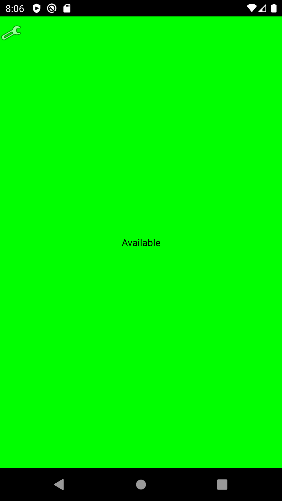
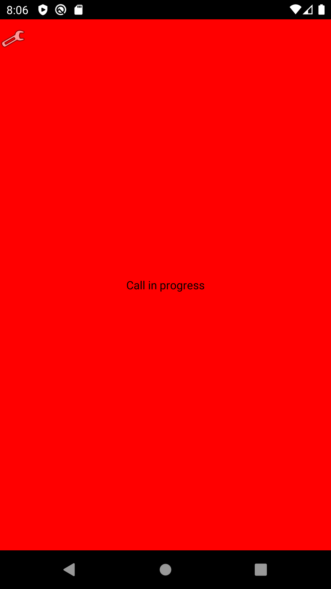

# DomenOnCall

This is an Android application that indicates if a Zoom video call is being performed on a computer or not.
The project consists of a Python REST server and an Android application.

## Screenshots

